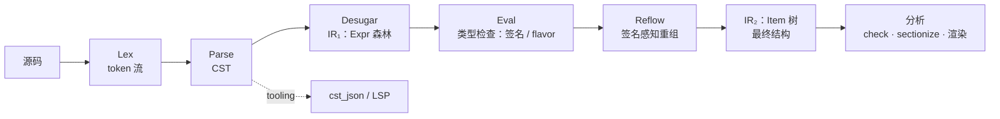
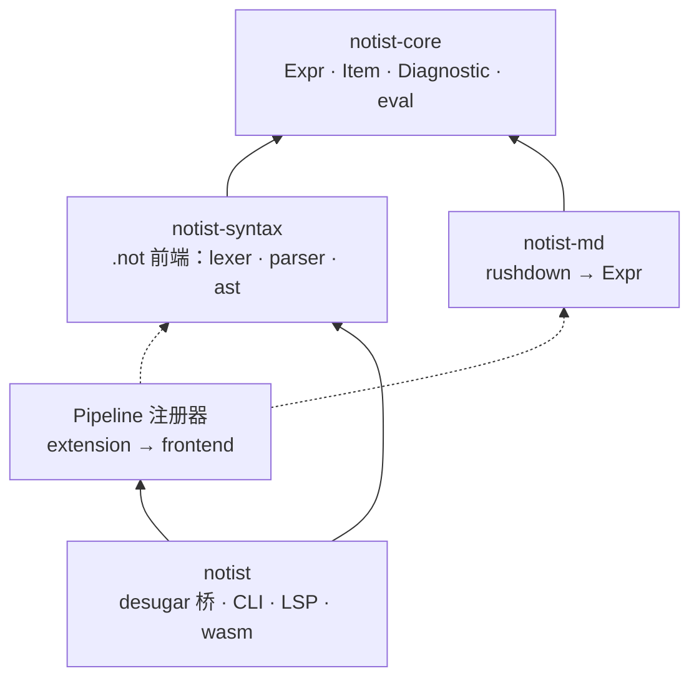
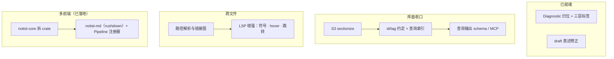

# 双 IR 模型与前端管线

2026-10-03 · 更新：双 IR 模型（语法容器 → 签名重组） · 状态：已落地 · 范围：语法、树模型、管线、库 API、工具链

## 动机

- trivia 在 parser 导航中的地位被重新论证：保留一等 token，把块结构/flanking/相邻性的信息需求下沉为词法期元数据，不做 typst 式吞并。
- `foo[..]` 的 body 与 `#` 后的匿名内容缺乏一致的模型；`#[...]` 需要成为属性标注的载体。
- CST 里的 Inline/Paragraph/Content 是包装节点：包装的是"没有别的语法时默认分组"的东西，不属于语法事实。

## 变更总览

| 领域 | 变更 |
|---|---|
| 词法 | `\`+特殊字符在词法期合并为单个 Escape token；预扫不再可能看到转义界定符 |
| 注解 | payload 必须是完整 Dict 字面量；挂载到紧随其后的节点（块级挂下一个块，行内须紧邻一个行内构造） |
| 内容 | `[...]` 携带 flank 声明的 flavor：紧贴 → InlineContent，两端留白/跨行 → Content；InlineContent <: Content 单向提升 |
| children | 结构挂载，不是参数；args 里禁止内容字面量（诊断指路） |
| `#` | 仅接受函数调用与内容字面量；`#[...]` 物化为透明 group 节点；`#(..)`、裸名 → 字面文本 |
| 级别 | 调用级别 = 构造器返回类型（元数据），不影响 CST 结构；段落中断/提升特判全部删除 |
| CST | Paragraph/Inline/Content 节点删除；树为平坦节点序列；段落分组下沉到 desugar |
| 诊断 | 语法/语义/类型三层，各层就近产生；分析（check/sectionize/渲染）作用于 Content 树 |
| 工具链 | clap 子命令 CLI；check（codespan-reporting 输出，exit code 可用）；LSP（全文同步 + publishDiagnostics） |
| 库面 | builtins 签名表（级别 + 接受性 + 可枚举名单）；Ctor::level()；descendants/find；serde feature；analyze() 全管线出口 |
| 双 IR | IR₁（Expr，语法容器，段落不承诺全 inline）→ eval（类型检查）→ reflow（签名感知重组）→ IR₂（Item，最终结构） |

## 架构

管线（错误就近诊断；两个 IR 分别落在类型检查前后）：

## 双 IR 模型

**IR₁（类型检查前，Expr 森林）——语法容器。** paragraph 由空行分组形成，**不承诺内部只有 inline**；块级调用可以合法地出现在段落里。携带作者声明的 flavor 与尚未解析的构造器名字。它是"写出来是什么就是什么"的树，没有任何类型信息介入结构。

**IR₂（类型检查后，Item 树）——最终结构。** 名字解析成构造器、flavor 校验与提升完成，再经 **reflow**（签名感知重组）：含块级调用的段落被切成 `paragraph | call | paragraph` 的兄弟序列。

reflow 的信息来源有两份，且**在 IR₁ 上就已齐全，不依赖求值**：

- builtins：静态签名表（`Ctor::level()`）；
- Custom / group：回退到作者声明的 flavor——因为 content function 是不透明原子元素（name + fields + children + attrs，数据而非行为），没有内部实现可推，唯一可用的类型信号就是写法声明。

原则收束：签名只校验、只标注；**唯一允许"签名改结构"的地方是 reflow 这一个显式 pass**。

多前端拓扑（notist-core 与 notist-md 已落地，含前端注册）：

## 关键设计决策

1. **trivia 保持一等**：块结构/flanking/相邻性下沉为词法期元数据；不降级，不换 pull 模型。
2. **flanking 是声明**：`[x]` vs `[ x ]` 由写作者声明内容 flavor；解析期用 flank 选择 body 文法，desugar 从 flank trivia 派生 flavor。
3. **children 是挂载不是参数**：`foo[..]` 是唯一的内容挂载写法；`foo([..])` 诊断。
4. **匿名内容 = 透明节点**：`#[...]` → group，渲染即内容，承接 attrs/结构。
5. **级别是元数据**：CST 不管 inline/block；`Ctor::level()` 供渲染/分析侧消费。
6. **CST 层级只表达物理嵌套**：章节等逻辑层级归 core 层（S3 sectionize）。
7. **诊断三层**：Syntax（parser）/ Semantic（desugar）/ Type（eval）；Diagnostic 类型归 core 层。
8. **前端注册 + 共享 eval**：`frontend::Pipeline`（Bevy plugin 式）——前端的职责只是 lowering（src → Expr IR），eval 统一在注册表里跑；默认注册 `.not` 与 `.md`，外部可用 `with_frontend` 扩展；check / core / query 统一经注册表按扩展名分派。
9. **双 IR 分离**：语法容器（IR₁）与签名重组（reflow → IR₂）分开——分组是语法的，中断是签名的；后者集中在唯一一个显式 pass 里，信息在 IR₁ 上即已齐全（静态签名表 + 声明的 flavor），不依赖求值。

## 任务拆解

## 验收

- corpus 快照：core 半区逐字节一致（除批准项：独占调用回段落包裹、Raw 进 core、span 收紧为恰好内容）；
- `cargo test` 全绿；wasm32 构建不受影响；
- check/LSP 端到端实测通过（诊断渲染、UTF-16 坐标、didChange 重分析、exit code）。

## 记录在案的边角

`#x[[t]]` 括号粘连；body 内 `\`+换行提前终止；块 body 里 `@!` 静默丢弃；args 不允许跨空行（开放规范问题）；dict typed key 的规范/实现合一（types.not 承诺 Int/Bool key，parser 目前只收 Ident/Str）。
