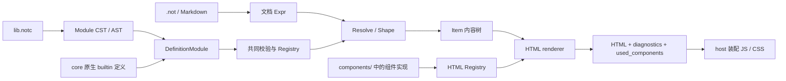
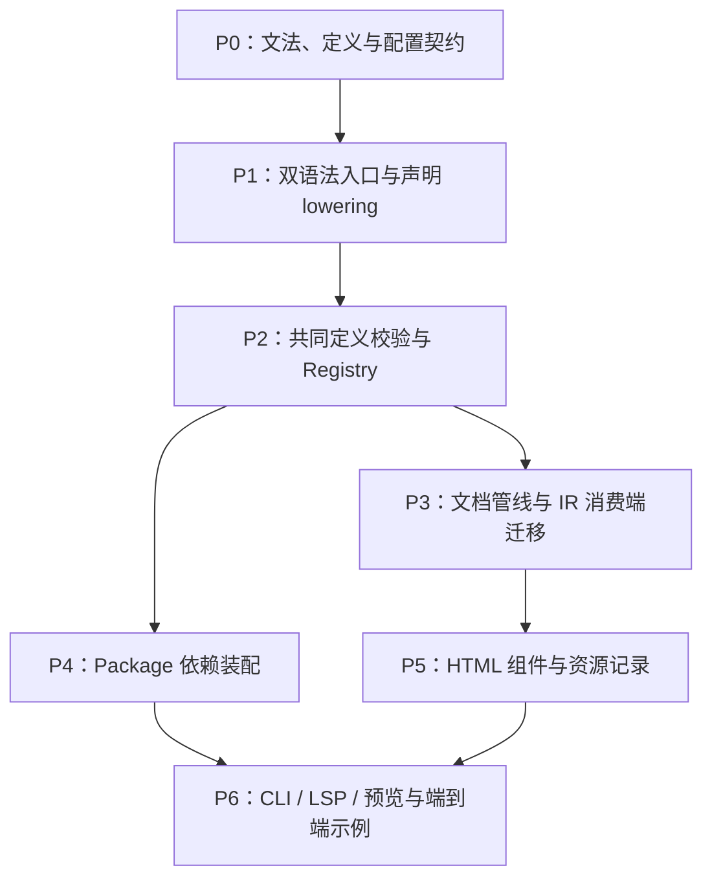

# .notc 声明模块与 Package / Plugin 扩展

2026-10-04 · 更新：Markup / Code 划分与统一函数注册 · 状态：已实现并验收 · 范围：语法、定义模型、core、package、配置、HTML、工具链

后续 crate 职责与宿主接入重构见[管线与 Vault 装配边界](2026-10-05-pipeline-vault-html.md)。本文保留第一阶段的实现与验收记录，后续草案尚未落地。

## 动机

- 内容函数的名称、参数契约和内容级别依赖内置定义，外部函数无法通过配置成为合法的文档节点；内置与扩展需要共同的定义和注册路径。
- `.not` 中的 `#foo(args)[children]` 是 Markup 调用语法，现有“Code 模式”的表述混淆了调用参数的词法状态与独立 Code 语言。
- 扩展 content function 需要声明签名与提供呈现实现；package、项目配置和组件资源之间需要明确的装配关系，避免文档或项目重复描述插件签名。

## 变更总览

| 层面 | 目标变化 |
| --- | --- |
| 语言划分 | `.not` 是 Markup，包含内容函数调用；`.notc` 是 Code，第一版提供声明子集 |
| syntax | 同一个 crate 提供文档与模块两个解析入口，共享基础设施，分别构造 CST / AST |
| 定义模型 | 新增 `FunctionDef` / `DefinitionModule`，与文档 `Expr` / `Item` 分开 |
| core | 内置与外部定义共用校验与 Registry；Resolve 与 Shape 消费注册信息 |
| 内容 IR | 合法调用保留稳定函数身份、字段、children、attrs 与解析后的内容类别 |
| package | 带有 lib.notc 的目录；第一阶段只有这个 Code 模块 |
| 项目配置 | `Notist.toml` 通过 dependencies 引入本地 package，依赖键确定当前环境的包名 |
| 名称解析 | 内置 prelude 支持 #callout；外部函数使用 #package::foo，保留包作用域 |
| 组件约定 | components/<函数名>.js 或 components/<函数名>/index.js 默认导出组件类，host 生成注册入口，无映射配置 |
| HTML | 统一目标注册，生成组件元素并记录实际使用的组件资源 |
| 工具 | CLI、LSP、预览工具使用同一个配置环境；lib 提供显式装配 API |

## 架构

首个目标是打通扩展 content function 的分析与 Web Component 显示：`lib.notc` 提供类型签名，JS 组件提供呈现，项目通过 `Notist.toml` 装配。第一阶段只实现函数声明，不引入函数体执行或 WASM 插件加载。



例如，安装 Mermaid package 后，项目可使用 `#mermaid::diagram("graph TD; A-->B")`。分析器按声明检查参数并保留调用；HTML renderer 输出组件元素，host 安装其 module，组件内部 DOM 不进入文档 IR。

声明、共同注册、配置文档分析、扩展 IR、包加载、HTML 组件与资源 host、CLI / LSP / Web 预览均已实现。当前接口见 [Code Syntax](../grammar/code.not)、[Content Function Extensions](../designs/content-functions.not) 与 [HTML Rendering](../html.not)。

## 定义与内容模型

core 的新增表示是定义信息，不是第二套可执行语言 IR：

```rust
struct DefinitionModule {
    functions: Vec<FunctionDef>,
}
```

`FunctionDef` 包含稳定身份、参数类型与绑定规则、默认值、children 契约和结果类别。语法 AST 中的类型引用和默认值在声明分析时转换为这些语义对象；源文件位置用于声明诊断，运行时不持有 CST。

内置通过原生 API 构造同样的定义，外部通过 `.notc` lowering 构造定义，随后进入同一个声明校验器和 Registry。名称解析、默认值、类型和值域检查以及内容类别判定不能按定义来源分成两套路径。

包中有非法声明时，编辑器仍可展示恢复后的 AST 和诊断，但该包不能部分安装到正式环境。跨包绑定及结构引用在装配时验证，全部通过后提交。源文件内容错误仍采用文档管线的恢复策略。

声明不进入文档 `Expr`，也不物化为 `Item`。当前文档管线继续处理调用；未来函数体和表达式求值需要自己的 Code IR，届时再增加。

### Markup 与 Code

`.not` 中的 `#foo(args)[children]` 属于 Markup 调用语法。它有固定的调用形状，参数是值字面量，children 仍是 Markup，不进入通用代码执行环境。匿名 `#[children]` 同样属于 Markup。

lexer 可以有正文、调用参数、字符串等词法状态，但这些状态不等同于切换语言。调用词法状态已改名为 CallPhase；CodeCall 保留为现有 CST / AST 名称，其语法归 Markup，不表示 Code 语言入口。

`.notc` 从文件起点持续使用 Code 词法，以模块为顶层结构。它需要自己的声明文法、token 支持、CST 节点、AST 访问器、错误恢复与诊断，不能直接把 `.not` parser 的入口换一个默认状态就完成。

两个解析入口保留在 `notist-syntax`：

```rust
parse_document(source) // .not，返回 Document CST
parse_module(source)   // .notc，返回 Module CST
```

共享标识符、字符串、数字、集合字面量、注释、trivia、源码范围与 rowan 基础设施。`.not` 的调用参数解析与 `.notc` 的默认值解析复用同一套字面量规则和值转换，避免语义漂移。

### .notc 声明模块

package 中唯一的 Code 模块是 `lib.notc`。第一版的顶层成员只有函数声明，使用分号结束；加载器不发现其他 `.notc` 文件，也不解析模块或 import：

```notc
fn diagram(source: String, theme: String = "default") -> Content;

fn panel(title?: String)[children: Content] -> Content;

fn badge(label: String)[children: InlineContent] -> InlineContent;
```

- `fn` 引入声明，没有函数体；入口文件中的顶层声明均可导出。
- 普通参数按声明顺序提供位置参数绑定，同时支持具名调用。
- `p: T` 必填；`p?: T` 可以省略且不自动插入值；`p: T = value` 在缺失时补默认值。可选标记与默认值不同时使用。
- 默认值只使用现有 Value 字面量，不执行表达式。
- `[children: T]` 声明独立的内容挂载，children 不成为普通参数；省略该部分表示不接受内容挂载。接受挂载不意味着调用时必须提供非空 children。
- 普通参数使用 Unit、Bool、Int、Float、String、Array、Dict 等值类型；元素类型表达按已有 `Array<T>` 记法设计，不能借集合类型包裹 Content 作为普通参数。
- children 使用 InlineContent 或 Content。返回 InlineContent 表示行内调用，返回 Content 表示块级调用，沿用现有签名用语，不引入另一个 BlockContent 名称。

第一版外部声明提供确定的返回类别。raw、group 的动态类别与内置结构约束继续由共同的定义模型表达；`.notc` 如何声明这些高级契约不属于基本声明子集，不能通过猜测函数名或 children 反推出扩展行为。

token、产生式、trivia 位置、类型引用和同步恢复规则已使用仓库 Grammar Notation 定义。语法错误应保留无损 CST，并尽量在分号或下一条声明处恢复，让后续声明可继续解析。类型名称、默认值和重复声明等错误在相应语义层产生诊断。

### Package 与依赖

**Package 是带有 lib.notc 的目录。** 第一阶段只有这一个 Code 模块，所有内容函数声明都位于其中。package 可以附带 Web Component 的浏览器资源，资源文件不构成 Notist 的模块系统。

提供组件实现的 package 可称为插件；它使用同一个 package 装配机制，没有另一份插件清单。

```text
project/
├── Notist.toml
├── document.not
└── packages/
    └── mermaid/
        ├── lib.notc
        └── components/
            ├── badge.js
            └── diagram/
                ├── index.js
                └── assets/
```

纯签名 package 只需要 lib.notc。组件资源随声明一起分发，项目不重复描述签名或逐函数配置 HTML 实现。

#### Notist.toml：项目依赖

```toml
[dependencies]
mermaid = { path = "./packages/mermaid" }
```

依赖路径相对于项目配置所在目录。loader 读取目标目录中的 lib.notc，分析并安装声明。第一阶段支持本地目录来源；由于 package 没有自己的清单，dependencies 的键 mermaid 就是当前环境中的包名。目录名不决定包名，暂不引入另一个规范包名或重命名配置。

第一阶段只装配项目直接声明的依赖。package 之间的依赖及其包名作用域另行设计；parse_module 始终只解析传入的单文件源码，不负责加载依赖。

#### 包路径与 Prelude

内置包使用保留名 notist，其内容函数默认进入 prelude。`#callout[...]` 与 `#notist::callout[...]` 解析到同一函数；语法糖固定引用 notist 的规范内置身份。

外部函数保留包作用域，使用 `#mermaid::diagram(...)`。安装依赖只引入包，不把其中所有函数加入 prelude；不同包可以声明同名函数。外部包不能占用 notist 名称。

调用目标的语法表示使用 Path 及其名称段。第一阶段 Resolve 接受一段的 prelude 名和两段的 package::function；更长路径可由通用路径语法保留，但报告暂不支持的语义诊断，不进行子模块发现。`.notc` 的函数声明仍使用包内局部名，例如 fn diagram，并不在声明中重复包前缀。

包名与函数名一起构成解析后的身份。未来类似 Rust 的模块路径可沿用 Path 表示，模块与 import 的规则在出现实际需求后设计。现阶段 package 始终只有 lib.notc。

CLI / LSP 按显式指定或文档所在目录最近的 Notist.toml 建立环境，不合并多层项目配置；没有配置时使用默认环境。lib 的纯分析 API 接收已装配环境，不自动读取文件、搜索父目录或执行网络操作。

#### Web Component 的文件约定

- 组件标签由包名与声明名生成：notist::foo 对应 notist-foo，mermaid::diagram 对应 mermaid-diagram。包名采用当前装配环境的包名，声明名采用 lib.notc 中的局部名。
- 简单组件使用 components/<函数名>.js；需要附属资源时使用 components/<函数名>/index.js。两种入口均默认导出继承 HTMLElement 的组件类。
- 同名文件入口与目录入口同时存在时报告冲突，不设置隐式优先级。
- 组件作者实现参数读取、内容呈现与生命周期，不编写 customElements.define 或包级注册入口；host 根据签名和实际使用记录生成统一注册代码。
- 样式、图片、辅助 JS 等文件放在组件目录内，由 index.js 按相对路径引用；组件管理样式的应用方式。
- HTML adapter 从定义与文件约定获得映射，不读取逐函数的 tag、module、styles 配置。

lib.notc 是函数声明的唯一来源。loader 按声明与使用记录检查对应的文件入口或目录入口，不通过扫描 components/ 增加内容函数。标签与属性的确定性命名编码及冲突检查需统一；重复加载同一组件可去重，冲突实现不能被静默覆盖。组件资源缺失属于目标层诊断，已经加载的语义定义仍可用于分析。

组件作者提供：

```js
// components/diagram/index.js
export default class Diagram extends HTMLElement {
  // 参数读取、呈现和生命周期实现。
}
```

host 为页面生成：

```js
import Diagram from "./packages/mermaid/components/diagram/index.js";
customElements.define("mermaid-diagram", Diagram);
```

这是浏览器资源的组织约定，package 的 Notist Code 模块始终只有 lib.notc，不增加 Notist 子模块机制。

### Content 调用与 HTML 映射

项目中的：

```not
#mermaid::diagram("graph TD; A-->B")
```

按签名补齐 theme 后，IR 保留 mermaid::diagram 身份和 source、theme 字段。HTML 映射产生：

```html
<mermaid-diagram
  notist-source="graph TD; A--&gt;B"
  notist-theme="default"
></mermaid-diagram>
```

有 children 的调用将其递归渲染为 light DOM，组件使用 slot 展示。只有这一个内容挂载；组件内部的标题、包装、图形等 DOM 由 JS 实现，不新增 Content 节点。

参数使用 notist-<参数名> 属性，注解继续通过现有 HTML attrs 规则映射。属性名编码、协议保留名称和冲突需要统一检查；HTML 转义与参数类型编码分开处理。

String 使用字符串内容，Bool 明确编码为 true / false，Int 保留 i64 精度，Float 保留 f64 语义，Array / Dict 使用保留类型与顺序的 JSON 协议。没有默认值的省略参数不生成属性。协议 v1 使用 notist-protocol="1"。复杂值递归表示为带类型的数组：Int 保存十进制字符串，Float 保存十六位 f64 比特，Dict 保存有序键值对。名称保留小写 ASCII、数字与短横线，其余 scalar 编码为 u<hex>x，非法首位前加 x；标签拼接、编码、保留标签及属性碰撞在 HTML 注册时拒绝。完整规则见当前设计文档。

内置 HTML handler 与 Web Component adapter 都通过同一个 HTML 注册入口绑定到函数身份。默认环境仍提供现有内置映射；组件绑定复用语义签名，不建立第二套类型声明。合法扩展与未知名称恢复节点需要明确区分。

最终 Item 必须保存本次调用解析后的内容类别，使 renderer、序列化与查询消费者不需要重新读取插件才能判断块／行内。内置 Ctor 变体保留，合法外部调用新增 ExtensionCtor；Item 新增 level 与 function_id 访问器。Ctor::name 改为 Cow<str>。query / debug JSON 提供规范身份、类别与完整树字段；serde 保存扩展契约与类别，旧内置树可省略类别。

### Web Component 分发与页面装配

第一阶段的分发产物是 lib.notc 与按约定提供的浏览器 JS / CSS，可以随仓库目录或压缩包交付。以后也可以发布为 npm package，Notist 的声明与装配协议不依赖某个包管理器。

组件作者提供浏览器可直接加载的组件 ES module，并处理好依赖。多文件产物保留相对 import 与其他资源所需的目录关系；host 生成注册入口，组件负责重连、更新与资源清理。

renderer 返回 html、渲染诊断和实际使用的组件记录。host 根据这些记录解析发布 URL、复制组件资源、生成 import 与 customElements.define，并去重。样式等附属资源保留组件的相对路径，由组件入口引用；资源装配覆盖 children 中的组件，不通过扫描 HTML 猜测依赖。

CLI、站点构建器与 Web 预览各自提供 host；notist-html 继续负责片段渲染。无 JS 时保留 light DOM children；无 children 的组件如果需要领域回退内容，由目标实现提供。

## 关键设计决策

1. **Markup / Code 分开**：`.not` 包含调用语法，`.notc` 承担独立 Code 文法；lexer 的内部词法状态不作为语言切换。
2. **同 crate、双入口**：notist-syntax 提供 Document 与 Module parser，共享基础词法、字面量和无损 CST 基础设施。
3. **声明先行**：第一版 `.notc` 以 lib.notc 为入口，只声明内容函数签名；默认值是字面量，函数没有执行体。
4. **定义与调用分开**：FunctionDef / DefinitionModule 进入注册表；文档 Expr / Item 保留公开调用结构，声明不成为 Content 节点。
5. **共同注册路径**：原生 builtin 与 `.notc` 声明构造同样的定义，使用同一个校验器、Registry 与调用检查逻辑。
6. **包路径与 Prelude**：内置包 notist 的函数进入 prelude；外部调用使用 package::function。组件标签使用包名和声明名，语法糖使用规范内置身份。
7. **单模块与约定装配**：一个 package 只有 lib.notc 这一个 Code 模块；项目 Notist.toml 引入依赖，标签与组件资源使用固定约定。
8. **children 保持单一挂载**：普通参数只包含 Value，children 渲染为 light DOM，由组件 slot 展示；组件内部 DOM 不展开成 IR。
9. **类别在分析时确定**：签名参与 Resolve / Shape，最终 Item 保存调用类别，消费者无需重新加载插件来判断块／行内。
10. **资源由 host 装配**：renderer 返回实际组件使用记录；host 安装和去重 JS / CSS。纯分析与片段渲染 API 不自动读取项目或下载资源。

## 任务拆解



1. [x] **正式语法与 parser**：在 notist-syntax 增加持续 Code 的词法入口与 Module parser，增加声明／参数／类型节点和 AST；Markup 调用增加 :: 路径及 Path 节点。整理调用词法的命名，提取共享扫描、字面量解析与值转换，保留现有无损 CST 行为。
2. [x] **定义模型与共同注册**：在 core 增加 FunctionDef、DefinitionModule、声明校验与 Registry，将内置名称、参数和类别规则迁入共同路径；`.notc` lowering 放在连接 syntax 与 core 的分析层，core 不依赖 parser。
3. [x] **文档管线接入**：Resolve 使用环境注册表，Shape 使用解析后的调用类别，最终 IR 表达合法外部身份。适配查询、dump、serde 和各消费端。
4. [x] **package 装配**：读取项目 Notist.toml 的 dependencies 和各目录的 lib.notc，处理本地来源与包归属，聚合带来源文件的诊断，建立不可变环境。配置或声明失败不进行部分安装。
5. [x] **HTML 组件**：增加目标注册、属性编码、组件依赖记录与 host 资源装配；用一个本地容器组件验证参数和嵌套 children，再接入 Mermaid 示例。
6. [x] **工具与文档**：CLI、LSP、Web 预览共用装配结果；分别提供文档分析与模块分析入口。更新语法文档、内置签名说明、依赖与组件约定和调用示例。

第一阶段结束时，必须能从真实 package 的声明入口走到文档中的合法调用和页面显示。

## 验收

- `.notc` 无损解析；错误声明不会吞掉后续声明；未知类型、重复参数、非法默认值等诊断定位到 lib.notc。
- 原生定义与同等 `.notc` 定义进入相同校验与注册路径，调用绑定和诊断一致。
- 项目配置启用插件后，限定调用不再产生 unknown constructor；内置简写与 notist 限定调用身份一致，外部同名函数在各包中分别解析。位置与具名参数、默认值、children 接受性和块／行内重组符合签名。
- package 加载失败不会留下部分注册；Notist.toml 与 lib.notc 的错误保留各自来源位置。
- 最终 IR、遍历、查询和序列化完整保留函数身份、内容类别与公开树结构。
- HTML 标签带包名前缀，同名函数的组件分别注册；参数转义正确，false、空字符串、省略值、大整数和复杂值不会混淆；children 顺序与身份保持。
- 静态页面与 Web 预览能加载组件；嵌套组件资源被记录并去重，组件重连不会重复创建 shadow root。
- 默认前端和内置内容函数保留现有行为，已有 corpus 与相关测试通过。第一阶段不引入插件执行引擎。

## 实施与验收结果

- core / 连接层：内置和源码定义共用绑定与 Registry；配置环境参与 Resolve / Shape，合法扩展保留身份和类别，查询、dump、debug JSON 与 serde 已适配。
- package：Project 提供纯源码装配与本地文件 loader，支持最近配置、显式配置、来源诊断及编辑器覆盖，失败不返回部分环境。
- HTML：HtmlRegistry 统一绑定内置与组件，协议 v1 保留标量与复杂值，RenderResult 记录实际使用组件；host 复制目录资源并生成去重注册入口。
- 工具：CLI 提供 html 构建及 .notc 检查 / CST / JSON；LSP 使用相同 loader，支持声明符号、hover、限定调用跳转和未保存声明的诊断刷新；Web 提供显式配置装配、组件 iframe 预览与模块检查。
- 示例：嵌套 panel、简单 badge 和 Mermaid 已走通声明 → 调用 → IR → 静态 HTML / Web 预览；当前入口为 [Vault 组件示例](../components/README.not)。
- 验证：workspace 全特性测试、WASM 构建、文档检查与 JS 协议测试通过；CLI / LSP 进程测试覆盖装配与恢复。Chromium 验证静态页面、Mermaid SVG、i64 精度、shadow root 复用及 Web 预览，未产生页面异常。

浏览器示例使用固定版本 Mermaid CDN 资源；离线分发由 package 提供本地浏览器依赖。第一阶段仍只有一个 lib.notc，没有 Code 求值、WASM 插件执行、传递依赖或远程包解析。

## 记录在案的边角

- `.notc` 声明的 token、trivia、类型引用与同步恢复规则已定义正式文法；高级值域、结构契约及动态返回类别的源码表达需另外设计。
- HTML 名称与协议按 v1 统一编码和校验，不使用 Value.to_string() 传递复杂值。
- 函数身份与调用类别的 IR 调整涉及 Ctor、query、dump 和 serde，公共接口及序列化迁移已在当前设计中说明。
- lib.notc、项目 Notist.toml 与文档调用的诊断分别保留来源文件和范围；配置失败与文档恢复不能混同。
- 包名与函数名组成标签时使用确定性编码，并检查拼接与编码碰撞；当前环境同一包名只对应一个来源。依赖键改名时，限定调用和 host 生成的标签一起改变，组件文件仍按局部声明名定位。

复杂 scripting、函数体、表达式及多模块需求出现后，再设计对应的 Code IR、模块与执行模型；第一阶段不预设子模块、入口切换或模块发现。WASM 可以作为后续的验证或执行后端，再接入共同定义与注册路径。远程 package 获取、依赖版本解析、锁文件和发布仓库也可独立增加。

这些扩展不能改变第一阶段的基本契约：内容函数在文档中保留公开调用结构，签名负责分析，目标实现负责呈现。
