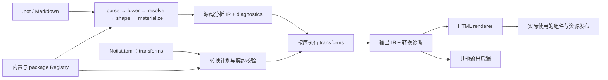

# IR Transforms 与内置内容的 Package 呈现

2026-10-05 · 状态：内置 replace 与 package 作用域已实现；条件筛选待讨论 · 范围：IR 转换、项目配置、内置 replace、package 组件、宿主扩展边界

## 动机

- `$…$` 与 `#math(...)` 产生内置 `notist::math`，安装声明 `katex::math` 的 package 不会改变这些节点的呈现。当前 HTML 默认显示公式文本，应用可通过 Rust 回调接入数学排版。
- package 已能声明内容函数并提供 Web Component；内置内容需要一种方式转成这些扩展节点，从而复用已有签名、属性协议、组件入口与资源分发。
- 后续可能需要宿主程序通过 stdio 改写内容树。应将这类能力组织为通用的 IR 转换阶段，内置节点替换是其中一种操作。

此前讨论的 HTML 目标覆盖只改变渲染绑定。本设计选择实际转换 IR：替换后节点的规范函数身份也随之改变，后端消费转换后的树，不增加 `html.renderers` 配置。

现有管线与宿主边界见[管线与 Vault 装配边界](2026-10-05-pipeline-vault-html.md)，package 机制见 [.notc 声明模块与 Package / Plugin 扩展](2026-10-04-notc-packages-plugins.md)。当前规范见 [IR Transforms](../designs/transforms.not)；stdio 扩展仍为后续方向。

## 变更总览

| 领域 | 目标变化 |
| --- | --- |
| 管线 | 在源码分析得到 Item 后、输出后端消费前增加显式 transforms 阶段 |
| 项目配置 | `[[transforms]]` 保存按顺序执行的转换列表 |
| 内置转换 | 第一阶段提供 `kind = "replace"`，按规范函数身份替换节点 |
| 定义环境 | 在同一 Registry 中解析源与目标函数，校验可保留字段、children 与内容类别 |
| package | 保持 lib.notc 与 components/ 约定，不增加插件清单或执行入口 |
| HTML | 消费转换后的扩展节点，沿用组件绑定及 used_components 记录 |
| 库与宿主 | 转换算法消费显式 IR、Registry 和计划；配置加载与外部进程归宿主组织 |
| 后续扩展 | 预留 command 转换方向；stdio 协议、进程执行与浏览器适配另行设计 |

## 架构



转换输入是已分析、物化的 Item，不重新解析源码，也不执行 `.notc` 函数体。`transforms` 表达内容树转换，不绑定特定输出后端。

源码分析结果与输出转换结果分别保留。LSP、源码查询和文档索引仍可消费原始分析树；渲染消费转换树。转换不原地修改调用者持有的 Analysis，不把 `katex::math` 冒充源码中实际调用的函数。

## 配置与 Package

### 有序转换列表

Notist.toml 配置：

```toml
[dependencies]
katex = { path = "./packages/katex" }

[[transforms]]
kind = "replace"
from = "notist::math"
to = "katex::math"
```

`from` 与 `to` 使用当前配置环境中的完整 `package::function` 身份，不使用 prelude 简写。依赖别名与现有 package 装配规则相同。没有 transforms 时保持现有行为。

各转换按配置顺序执行，后一项消费前一项的结果。单条 replace 对输入树执行一次遍历，每个节点只匹配一次；新身份不在同一条规则中反复匹配，不寻求固定点。例如 A → B、B → C 两条规则可以在两次转换中得到 C。

### 数学 Package

```text
katex/
├── lib.notc
└── components/math.js
```

```notc
fn math(text: String) -> InlineContent;
```

源码、分析与输出的关系：

```text
$x^2$ / #math("x^2")
    → notist::math { text: "x^2" }
    → katex::math  { text: "x^2" }
    → <katex-math notist-protocol="1" notist-text="x^2"></katex-math>
```

katex package 定义自己的函数，不能占用保留包名 notist。作者也可以直接使用 `#katex::math(...)`，这种调用无需替换。组件按原有协议读取参数并实现呈现；引擎不需要知道组件内部使用哪种数学库。

katex 示例位于仓库根目录 packages/katex，自带 Notist.toml 与 README.not，使用者在自身配置中安装。替换本身不需要 WASM；组件是否使用 JS、WASM 或其他浏览器资源由 package 作者选择。

## Replace 模型与职责

### 契约校验

内置 replace 是保留内容的身份替换，不是任意结构重写。第一阶段采用保守的兼容条件：

- 源与目标必须已注册，不以函数名猜测目标，也不将未知名称恢复节点当作合法调用。
- 普通参数的名称、类型、必填 / 可选 / 默认值规则及值域约束相同；声明位置、说明文字和位置参数书写规则不参与已物化节点的兼容判断。
- children 接受契约相同，返回类别是相同的固定 Inline 或 Block。动态类别转换留待进一步设计。
- 仅支持没有特殊结构职责的函数，例如 math。heading / section、list / item、table / row / cell 等依赖结构轴或 Shape 语义的节点不纳入第一阶段简单替换。

签名兼容使合法节点可直接转交字段。源码错误的恢复树可能仍含非法字段，不能据此假定每个节点均有效；执行时遇到不符合替换契约的节点，保留该节点并产生转换诊断，不丢弃字段或 children。

参数改名、计算新参数、插入或删除包装节点、改变内容级别均不属于 replace。以后可以增加独立转换类型，不将这些行为隐藏在身份替换中。

### 节点转换

替换覆盖整棵 children 树，包括段落、列表项、表格单元格和嵌套扩展中的 math。普通参数依然只保存 Value，不引入 Content 参数或 slot 模型。

匹配节点的 ctor 改为目标签名对应的构造器；外部目标使用 ExtensionCtor，保存目标函数身份与契约。fields、children、attrs、span 及最终内容类别保留。替换不改变子节点顺序，不重新执行 sectionize 或 reflow。

源码 span 继续指向原来的 `$…$` 或 `#math(...)`，以支持转换后的渲染诊断和 source map。源码诊断独立保留；配置身份或兼容性错误指向 Notist.toml，逐节点转换错误指向原节点。

### 装配与执行

顶层 notist / Vault 读取配置，在 Environment 的共同 Registry 中编译和校验转换计划。配置错误时不提供部分装配的正式计划。

纯转换算法归 notist-pipeline，接收 Item、Registry 与已校验计划，不搜索配置、不读取资源、不启动进程。notist-core 保留共同节点与定义模型；notist-html 不调用转换器，只消费结果。

输出组合入口组织“分析 → transforms → 后端”，返回源码分析、转换诊断与渲染结果，避免重复分析。库消费者也可显式调用转换后将树交给自己的后端。TransformPlan / TransformOutput 提供纯算法入口；Vault::transform 提供配置转换，render_output 接收已有 Analysis 树，render_html 组合源码分析与输出。HtmlOutput 保留原始 Analysis、transformed 和 rendered。

HTML 按目标函数身份发现组件，used_components、注册入口、目录资源和浏览器 URL 都归目标 package。缺少目标组件是渲染诊断，不是转换签名错误；无需覆盖内置 HTML 注册项。

## 后续条件筛选：待讨论

考虑将匹配条件扩展为“规范函数身份 + 节点谓词”，根据参数与 attrs 选择需要转换的节点。现有 Item 已保留绑定后的 fields 与 attrs，两者均为 Dict；纯谓词读取这些值即可，不需要为筛选改变 IR，也不执行用户代码。

以下仅为讨论中的配置示意，尚未实现或确定为正式语法；raw → diagram 还需要独立的参数映射与类别设计，不能仅靠现有 replace 执行：

```toml
[[transforms]]
kind = "replace"
from = "notist::raw"
to = "mermaid::diagram"

[transforms.where]
and = [
  { args = { lang = { eq = "mermaid" } } },
  { not = { attrs = { skip = { eq = true } } } },
]
```

配置显式区分 args 与 attrs：args 对应 IR 的已绑定 fields，attrs 对应节点属性，避免裸 lang 键的查找范围不明确。上例希望匹配语言为 mermaid 且未明确设置 skip = true 的节点。where 省略时可保持按函数身份匹配的现有行为。

### 缺失与空值

Dict::get 返回 Option<&Value>，能够区分键不存在与键存在但取某个值。建议使用明确的存在性谓词，不将缺失折叠成 false、空字符串或 Unit：

| 意图 | 条件示意 |
| --- | --- |
| 属性不存在 | `{ attrs = { skip = { exists = false } } }` |
| 属性存在，不关心值 | `{ attrs = { skip = { exists = true } } }` |
| 属性值为空字符串 | `{ attrs = { skip = { eq = "" } } }` |
| 属性值为 false | `{ attrs = { skip = { eq = false } } }` |

建议缺失键的 eq 结果为 false。因此 not(eq(true)) 接受缺失、false 与其他不等于 true 的值；若只接受显式 false，应写 eq = false。Value::Unit（源码中的 `()`）是实际值，不等于键缺失。TOML 没有原生 null / Unit 字面量；如果需要判断 Unit，应另行确定谓词表达，不借用空字符串或缺失作为编码。

args 匹配分析后的绑定值。有默认值的参数会看到已物化的默认值；可选且未提供的参数可能缺失。这套筛选不能判断一个有默认值的参数是否在源码中显式传入，不为此扩展当前 IR 的来源记录。

### 谓词与校验边界

首批可考虑 and / or / not / eq / exists，由配置解析为纯谓词树，在函数身份匹配后检查。字段名、args 与 attrs 的边界、值比较语义、组合项与空组合的合法性仍需确定。args 字段可以根据源 FunctionDef 校验名称与值类型；attrs 没有统一字段 schema，不能套用参数声明校验。数组、字典、浮点数及 Unit 的比较与配置编码也需明确，不引入隐式类型转换。

谓词仅决定是否匹配，不负责改名参数、计算值、消费属性、改变 children 或内容类别。已有的契约校验、恢复树诊断与逐规则遍历语义如何与条件匹配组合，需要在实现前确定。

### 默认规则冲突与根覆盖

当前 package 默认规则按 from 身份去重、检查冲突，根规则也按 from 覆盖。加入 where 后，同一个 raw 可能分别有 mermaid、其他语言的规则；沿用现有分组会把这些规则全部判为冲突，根配置覆盖一个条件也会删除其他条件的默认规则。

需要重新讨论规则身份、去重、冲突与覆盖粒度，以及多个谓词同时匹配时的行为。相同谓词结构可以比较，但谓词结构不同并不证明匹配集合互斥；不能直接把任意谓词的逻辑重叠判断当成装配条件。是否使用显式规则名称、条件结构或其他覆盖机制尚未确定。

### raw → diagram 与字段映射

筛选不解除 replace 的同契约限制。notist::raw 的参数为 text / block / lang，返回级别由 block 决定；mermaid::diagram 的参数为 source / theme，返回固定 Block。现有 replace 因字段与返回契约不同而拒绝转换，即使 where 能选择 lang = mermaid 的节点也不会改变这一点。

实际支持此用例还需要设计 text → source 的字段映射、lang / block 的处理、theme 默认值的绑定，以及源节点级别与目标固定 Block 的一致性校验；不能丢弃现有字段或默认假定所有带语言标记的 raw 均为块级。倾向先把纯条件筛选与参数重写分开讨论，再确定是否需要独立转换类型。

本节记录后续方向与待决问题，不修改已实现 replace 的正式契约，也不表示已经支持 where 配置。

## 后续 Stdio 扩展

同一个有序列表可在后续扩展为：

```toml
[[transforms]]
kind = "command"
command = ["my-notist-transform", "--option"]
```

这是后续方向，第一阶段不接受或执行 command。拟由宿主通过 stdio 将 IR 交给外部程序，接收转换后的 IR；算法层不依赖进程 API。command 使用参数数组，避免将配置当作 shell 脚本解释。

实施前需要单独确定协议版本、请求与结果封装、完整 IR / Value 的无损编码、Registry 信息、来源映射、输出树校验、诊断及进程失败行为。现有 serde 能力可以作为基础，但调试 JSON 和 Web Component 属性协议不能直接视为稳定的进程协议。

浏览器没有原生子进程。内置 replace 可使用同一 Rust 实现编译到 WASM；command 由有进程能力的宿主提供，浏览器需要自己的适配方案。stdio 扩展不改变 package 只有一个 lib.notc 的约定。

## 关键设计决策

1. **使用 transforms**：表示有序 IR 转换，配置不归 html.renderers。
2. **实际改变输出节点身份**：内置 math 转成 package 函数，复用已有组件路径。
3. **原始分析与输出转换分开**：源码工具可以保留内置语义，输出使用转换结果。
4. **先做保守 replace**：保留字段和结构，不引入通用改写语言或代码执行。
5. **装配共享 Registry**：替换契约与 HTML 组件使用同一份已加载声明。
6. **stdio 分阶段设计**：保留扩展方向，当前不固定线协议或启动外部程序。

## 任务拆解

1. [x] 解析 `[[transforms]]`，保留配置来源与顺序，校验规范身份与兼容契约。
2. [x] 在 pipeline 提供纯 replace 执行入口，保留字段、树顺序、类别与 span，处理恢复节点。
3. [x] 将转换计划接入 Environment、Vault 输出及显式准备的输入；保留原始 Analysis。
4. [x] 接入 CLI 与 Web 预览的共同转换路径，HTML 继续按目标 package 记录和发布组件。
5. [x] 增加数学 package 示例，验证 `$…$`、显式调用与 Markdown math 得到同样的输出目标。
6. [x] 实施完成后新增当前规范 `docs/designs/transforms.not`，同步 Pipeline、Packages 与 HTML 文档。

## 验收

- 无配置时源码 IR 与现有 HTML 行为保持一致。
- 两种前端的 math 及嵌套 math 均可转换为 package 节点；原始分析树仍保留 notist::math。
- 参数、精度、children、attrs、内容类别与 span 保留，source map 对应原始源码。
- 未知身份、不兼容签名、结构职责节点及无效恢复节点有明确诊断，不静默丢弃内容。
- 多条转换按配置顺序执行，不出现同一条 replace 的递归替换。
- 静态输出与浏览器预览加载目标组件，实际使用记录与资源发布一致；缺失组件仍走目标层诊断。

## 记录在案的边角

- 转换用于某个输出后端时，应用需要明确选择转换计划；后端筛选或多输出配置尚未设计。
- `replace` 的严格同契约条件可以覆盖 math，但不一定覆盖带额外可选参数的呈现函数。默认值补齐、字段映射与更宽松兼容需要独立规则。
- 身份替换改变转换树中的查询结果；需要原始语义的消费者应读取 Analysis，不能仅依赖源码 span 推断原始函数。
- 通用结构改写可能需要重新验证内容树、更新类别与来源映射，不沿用简单 replace 的保留假设。
- stdio 扩展的稳定协议与缓存失效另行设计；目前已有命令配置示意不表示支持外部程序。


## 实施结果

- pipeline 新增 transforms 模块，计划编译检查身份与契约，逐规则遍历 children；字段验证复用 core 的 FunctionDef，不做再次绑定或默认值插入。
- 配置解析返回 dependencies 与有序 transforms；Environment 在同一声明环境编译计划，Vault 保留源码分析树并生成独立输出树。
- CLI、普通预览、调试预览与 PreparedInputs / Worker 路径共同执行转换；诊断来源区分 analysis、transform、render 和 environment。
- 实际 package 迁到仓库根目录 packages/，docs/package.not 保留模型说明与示例索引，各 package 自带 README.not 与 Notist.toml。workspace、构建入口、忽略规则、声明路径与测试同步迁移，不保留旧路径或兼容入口。
- katex package 声明同契约 math，默认导出组件，使用固定版本 KaTeX ESM / CSS。Example 展示内置调用、语法糖和直接 package 调用；组件支持属性更新、重连与错误恢复。
- typst package 提供相同的 math 签名，通过 typst.ts 的固定版本 WASM 在浏览器编译 Typst 数学源码并输出 SVG。共享编译器串行处理公式，保留源码与错误恢复，按字号缩放并使用 Typst 基线；packages/typst/README.not 展示直接调用和替换配置。replace 不转换 LaTeX 与 Typst 数学方言。
- 各 package 的 Notist.toml 注册自身并装配 README 的预览环境；widgets 的组合示例显式引入相邻 package。docs/package.not 只保留模型说明与示例索引，grammar 展示页并入 package README。package 清单提供 name、公开依赖与默认转换；宿主递归加载公开依赖，dev-dependencies 与 dev-transforms 只在根环境生效。
- Vault::index 补载实际链接到的正文，以逻辑绝对身份去重、解析跨目录链接，诊断与 backlinks 仍使用扫描根相对路径；缺失目标与锚点继续校验，循环链接不重复分析。

## 验证结果

- workspace 全特性测试通过；新增纯转换与宿主测试覆盖规范身份、配置来源、兼容性、顺序、恢复节点、精确值、两种前端、分析树保留和 source map。
- 文档检查、JS 协议测试、Web WASM 与 grammar package 构建通过。
- Chromium 验证静态导出、Web 预览、Markdown math、KaTeX 参数更新 / 重连 / 错误恢复及字体加载；迁移后的 grammar WASM 与组件资源继续通过浏览器验证。
- Typst 浏览器验证覆盖实际 SVG、多个公式的编译隔离、属性更新、重连、错误恢复、空值清除、字号与基线，以及 .not / Markdown 经 Worker 使用替换配置。CLI 测试验证真实 Typst package 的签名兼容、两种前端输出与目录组件资源复制。
- 严格 workspace Clippy 仍受既有警告影响，涉及 Markdown、pipeline 和资源 / 索引等未修改实现；本次新增转换代码与接入未产生 Clippy 警告。

## Package 清单与作用域实施

- 每个 package 必须提供 Notist.toml 的 [package].name；根配置自动注册 lib.notc，依赖键与规范名称匹配，普通文档项目可无 package 身份。
- loader 递归读取公开依赖，共享资源去重，检查循环与同名不同来源；依赖的默认转换自动引入，相同规则去重，冲突要求根显式覆盖。
- 根 dev-dependencies 仅引入依赖的公开配置；根 dev-transforms 覆盖同源默认与公开规则，不传播给消费者。
- 浏览器资源准备、描述、普通呈现与调试统一使用 PreparedInputs，删除 PreviewPackage 和原有 config + package map 的重复入口；原生与 WASM 共用图装配与转换作用域规则。
- package 模型集中在 docs/package.not，各 package 的清单与 README 迁移到新模型。
- workspace 全特性测试通过；新增测试覆盖共享依赖、循环与名称冲突、默认规则冲突与根覆盖、开发作用域隔离及诊断出处。JS 资源准备测试、文档目录检查、五个 package 的 HTML 导出、Web WASM 构建与实际 Chromium 预览验证均通过。
