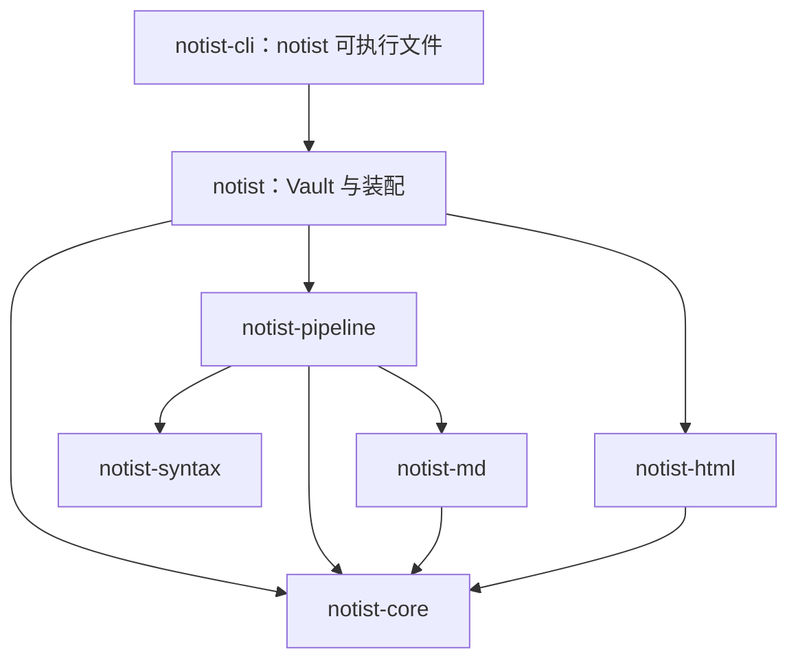
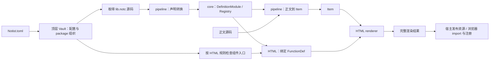

# 管线与 Vault 装配边界

2026-10-05 · 更新：pipeline 提取与统一 package 环境 · 状态：本轮重构已实现 · 范围：crate 组织、声明装配、Vault、HTML、库 API、宿主接入

## 动机

- 顶层 `notist` 混合了源码处理、配置加载、HTML host、调试输出和工具入口；现有 `notist-core` 同时包含共享模型与后端管线算法，库消费者难以按职责选择依赖。
- package 的声明环境和 HTML 环境由不同入口分别装配。底层能力可以复用，但宿主仍需自己组织配置、声明、组件绑定和完整渲染结果。
- 浏览器预览接口返回调试 JSON，重复处理正文，且没有传出已经生成的 source map；编辑器需要直接消费 typed API。
- 现有 `Vault` 只保存文档索引、链接及诊断，名称没有区分整个文档库与其派生索引。

本轮整理现有能力的归属和组合入口，目标是让 Celestite 等宿主提供输入后复用 Notist 的装配与处理流程。资源访问纳入最小接入边界；环境缓存和局部增量继续由[资源访问与增量计算草案](2026-10-05-resource-access-incremental-draft.md)另行设计。

## 变更总览

| 领域 | 目标变化 |
| --- | --- |
| core | 保留 Expr、Item、Value、定义、Registry、诊断和共同契约；暂不提取独立 IR crate |
| pipeline | 新增 `notist-pipeline`，收拢前端调度、lowering、resolve、shape、materialize 和声明源码转换 |
| 顶层 notist | 组织 Vault、配置解析、package 加载以及 pipeline 与 HTML 的组合调用 |
| Vault | 持有文档与 package 组织信息、装配环境，并提供处理与渲染入口 |
| VaultIndex | 现有多文档索引和链接检查结构改名，作为 Vault 的派生结果 |
| HTML | 共享组件入口规则与签名绑定，继续输出片段、诊断、source map 和组件使用记录 |
| CLI | 独立 notist-cli crate，生成 notist 可执行文件，持有终端诊断、静态发布、query 输出包装与 LSP 适配 |
| 库 API | 提供 typed 装配与渲染入口，JSON 和调试页面作为适配层 |
| 资源 | 接受宿主提供的资源或已准备输入，支持本地加载与内存覆盖，避免管线内直接 IO |
| 浏览器 | 提供可分发的组件协议与注册 runtime，组件实现由浏览器加载 |

## 架构

crate 依赖方向如下，箭头表示依赖。`notist-html` 消费 core 模型，不依赖 pipeline 或顶层 Vault；Markdown 前端继续只输出共享 Expr。

资源取得和环境装配由顶层协调。`lib.notc` 经 pipeline 转成 core 定义；正文处理和 HTML 绑定使用同一份声明环境。

## 模型与加载职责

### 共享模型与处理管线

`notist-core` 继续定义 Expr、Item、函数身份、定义模块、Registry 和诊断。共同声明校验与注册规则随定义模型保留；本轮不新增 `notist-ir`，也不把顶层 package 目录模型塞进 core。

`notist-pipeline` 接收源码和语义 Registry，组织 `parse → lower → resolve → shape → materialize → Item`。现有顶层 frontend、desugar、声明 lowering 与 core 后端算法迁入这一层。syntax 仍负责无损解析和 AST 视图，Markdown 前端仍输出 Expr。

pipeline 还提供 `.notc` 源码到 `DefinitionModule` 的转换入口。声明模型属于 core，源码转换属于 pipeline；文档恢复树与不可部分安装的声明模块继续采用各自的错误策略。

### Vault 与派生索引

顶层 Vault 持有文档与 package 的组织信息，协调声明环境、pipeline 配置与 HTML 环境。它调用下层 API；下层只接收 Registry、定义、组件入口引用等输入，不依赖具体 Vault 类型。当前无需引入覆盖全部能力的 Vault trait。

现有 `src/vault.rs` 中的多文档索引、链接、诊断及 backlinks 能力改称 `VaultIndex`。它属于派生结果，不承担 package 装配。单文档 Index 的命名可随迁移明确，但不扩大其职责。

文档库范围与配置作用范围分别表达。现有按文档最近的 `Notist.toml` 选择环境的行为保留；一个 Vault 内可能需要多个环境，不能把当前 Project 简单改名后固定为全库唯一 Registry。具体存储结构由实施时选择。

### 配置与声明加载

顶层解析 `Notist.toml`，确定依赖别名和资源位置，通过宿主资源入口取得各 package 的 `lib.notc`，调用 pipeline 生成定义模块，再安装到 Registry。包名、来源及资源位置由顶层维护。

声明装配失败不返回部分可用的正式环境，诊断保留配置或声明的来源与范围。pipeline 不自行寻找配置，也不读取 package 目录。

### HTML 组件绑定与浏览器实现

HTML 层定义 `components/<函数名>.js` 和 `components/<函数名>/index.js` 的候选规则、选择校验以及组件绑定 API；顶层依据这些规则驱动资源检查。二者同时存在仍报告冲突。

HtmlRegistry 使用已装配 Registry 中的 FunctionDef 绑定组件入口，不重新解析 `lib.notc`。HTML 参数编码、标签生成、冲突检查和实际使用记录继续由 HTML 层实现。缺少组件实现属于目标诊断，不使合法声明失去语义有效性；纯正文处理无需先成功装配 HTML 环境。

Rust 侧保存组件入口引用与签名绑定，不解析或执行 JS。宿主为实际使用的资源提供浏览器加载位置，浏览器 import 默认导出的类并注册。组件目录中的 CSS、辅助模块和 WASM 等相对资源关系必须保留。

### Typed API 与完整结果

Vault 提供源码处理与 HTML 渲染的组合入口，也允许消费者分别使用 pipeline 与 HTML。具体函数名待实施确定，输入输出使用结构化类型。

组合入口只运行一次正文管线，并返回文档诊断、渲染诊断、HTML、source map 和 used components。诊断保留阶段及来源，宿主负责其编辑器坐标转换。调试 CST、AST 和中间 IR 按需获取，不成为普通预览的强制输出。

顶层继续提供常用类型重导出。CLI、终端诊断、静态发布与 LSP 适配由独立 `notist-cli` crate 提供，LSP 在 CLI 中通过 feature 按需开启，调试阶段按需收集，纯库消费者不必因为使用 Vault 而引入所有宿主工具。

### 最小资源接入边界

本轮明确声明源码、逻辑位置、组件入口检查和未保存覆盖的输入方式，至少提供本地与内存输入路径。读取失败和资源不存在需要区分，物理文件路径与浏览器 URL 不继续混为同一种位置。

资源取得可以异步准备，正文 pipeline 保持同步计算。优先支持向 Worker 传入已准备好的确定输入；通用异步资源接口的形式和归属不在这里提前锁定。暂不引入环境缓存框架或局部增量算法。

## 关键设计决策

1. **保留 core**：共享模型继续使用现有 crate，暂不提取独立 IR crate。
2. **管线命名为 pipeline**：它表达源码到最终内容树的处理流程，并承担真实的结构变换。
3. **装配由顶层协调**：配置与 package 组织属于 Vault，pipeline 和 HTML 不反向依赖 Vault。
4. **声明只转换一次**：正文处理与 HTML 绑定消费同一批 FunctionDef，不分别加载签名。
5. **HTML 规则由 HTML 层维护**：候选入口、参数协议和绑定校验共享，具体 IO 由顶层驱动。
6. **派生索引明确命名**：VaultIndex 保存索引和链接检查结果，Vault 组织输入与环境。
7. **普通预览使用 typed API**：完整结果来自一次正文处理，调试输出按需生成。
8. **资源与增量分阶段**：先建立宿主输入边界，缓存和细粒度计算沿用独立草案继续设计。

## 任务拆解

1. [x] **提取 pipeline**：迁移源码桥接和后端算法，调整 crate 依赖与重导出，核对内置、扩展和 Markdown 输出一致。
2. [x] **整理 Vault**：明确配置环境与文档范围，迁移 Project 装配能力，将旧 Vault 改称 VaultIndex。
3. [x] **收拢 HTML 绑定**：提取入口规则与纯绑定 API，供本地加载和显式输入共同调用。
4. [x] **补齐资源和 typed 入口**：接入本地与内存输入，消除普通预览重复处理，完整返回映射和组件记录。
5. [x] **迁移现有工具**：CLI、LSP、WASM 和浏览器预览使用共同入口，隔离工具依赖并更新当前接口文档。
6. [x] **验证宿主接入**：明确 Celestite 环境输入、预览结果和资源 URL 的契约，以真实 package 验证后安排其仓库迁移。

本轮先完成 Notist 的可复用接口与现有消费者迁移。Celestite 的具体存储适配、任务环境失效和多 Vault 组件隔离需要结合其实现继续确定；记录方向不等于已完成接入。

## 验收

- core 不依赖 pipeline、HTML 或顶层；HTML 不依赖 pipeline，源码处理不引入文件系统或浏览器 IO。
- 前端、内置函数、扩展声明和内容结构的既有行为保持一致；package 装配保留原子性和准确来源诊断。
- 相同声明供正文与 HTML 使用，缺少组件实现不影响纯语义处理；组件入口冲突在绑定阶段报告。
- 本地输入与内存输入得到一致 IR、诊断及组件记录；未保存覆盖能作用于声明装配。
- typed 预览同时返回 HTML、source map 和嵌套组件记录，不为调试输出重复处理正文。
- 静态页面与浏览器预览保留参数协议和组件目录相对资源，真实 package 能显示。
- workspace 相关测试、CLI/LSP 工具测试、WASM 构建与浏览器组件验证通过；阶段完成后记录实际结果。

## 记录在案的边角

- 源码入口使用 `Pipeline`，配置装配使用 `Environment`，资源与多文档组合使用 `Vault`，派生索引使用 `VaultIndex`。所有调用方直接迁移到这些入口，不保留旧名称包装和旧模块路径别名。
- Markdown crate 的完整管线测试在后端迁移时调整归属，避免让 frontend 正常依赖反向指向 pipeline。
- HTML 环境可按需装配，避免未使用组件的目标问题阻止纯正文处理。
- 声明来源诊断与正文诊断可能属于不同文件，坐标转换必须使用对应源码。
- 环境变化触发预览重算与拒绝旧结果属于接入正确性；细粒度缓存不是其前提。
- 资源访问的完整版本机制、内存回收和局部增量留在独立草案；本轮不引入 Code 求值、传递 package 依赖或远程包发布系统。

## 实施结果

- `notist-pipeline` 收拢前端调度、desugar、声明 lowering 和 resolve / shape / materialize。core 保留模型、定义、注册与共同校验，HTML 继续只依赖 core。
- 顶层 `Vault<R>` 组合 `Resources`、按最近配置选择的 `Environment`、pipeline 与 HTML。`FsResources`、`MemoryResources`、`OverlayResources` 共用装配规则，`PreparedInputs` 提供可序列化 Worker 输入。环境在同一输入视图内保留，输入变化后重建 Vault。
- `render_html` 返回 `HtmlOutput { path, analysis, rendered }`，其中 RenderResult 完整保留 HTML、渲染诊断、source map 与嵌套组件记录。`inspect` 在同一次正文处理过程中收集中间阶段，JSON writer 只序列化这些结果。
- HTML 定义候选路径、选择校验及 `HtmlRegistry::from_bindings`。顶层驱动资源检查，绑定引用同一 Registry 的签名；`ModuleLocator` 区分资源路径与发布 URL。静态页面消费已渲染结果，按使用记录复制组件目录和附属资源。
- CLI、LSP、WASM 与 Web viewer 已迁移。命令行、终端诊断、静态页面发布、query 输出包装与 LSP 的 stdio 服务位于独立 `notist-cli` crate，可执行文件仍叫 `notist`；CLI 默认开启自己的 `lsp` feature，顶层库完全移除 tokio 与 tower-lsp 依赖。LSP 一批诊断使用同一份未保存文档快照；Web viewer 忽略过期配置加载，并保留加载期间的正文编辑。
- `crates/notist-html/runtime` 提供独立的参数解码与注册入口，web 中只保留重导出。普通 WASM 预览使用 `render_project` / `render_prepared`，调试页面使用 `analyze_project`；JSON 附带来源路径及 analysis / render / environment 诊断来源。

`query::select` 保留可复用选择逻辑；共享 IR JSON 编码归入 `notist::json`，CLI 仅添加查询结果与源码文本包装。`VaultIndex` 只保存派生索引，旧的 `load` / `load_with` 文件遍历实现已删除，统一由 `Vault::index` 装配并处理文档。

`src/project.rs`、旧的 `Notist` facade 和顶层阶段模块路径重导出已删除。测试直接向 `Pipeline` 传入 Registry；`Environment` 只通过 `Resources` 装配，最近配置选择归入 `Vault`，删除旧的文件系统加载包装与吞掉访问错误的配置发现入口。Markup parser 统一使用 `parse_document`，移除旧 `parse` 别名。

当前接口说明已更新到 [Pipeline](../designs/pipeline.not)、[Content Function Extensions](../designs/content-functions.not) 和 [HTML Rendering](../html.not)。`examples/prepared_preview.rs` 演示宿主准备配置、声明和组件资源，传入 Worker 后取得完整渲染结果。

## 验证结果

- `cargo test --workspace --all-features` 通过，包含语义回归、Markdown 管线、声明原子性、HTML 参数协议及 CLI / LSP 工具测试。
- 新增 Vault 接入测试覆盖：最近的多个配置、未保存配置与声明、准确来源诊断、入口冲突与语义有效性、访问失败与缺失区分、本地 / 内存一致性、正文只处理一次、调试可选以及普通 Worker 结果。默认 features 下可运行。
- `cargo test -p notist-cli` 与 `cargo test -p notist-cli --no-default-features` 通过，CLI / LSP 测试随可执行文件迁入该 crate；`--help` 保留 `notist` 命令名。运行方式为 `cargo run -p notist-cli -- …`，安装方式为 `cargo install --path crates/notist-cli`。
- `cargo check --no-default-features` 通过；正常依赖树不含 clap、codespan-reporting、tokio 或 tower-lsp。`prepared_preview` 示例运行通过。
- Web analyzer 与 grammar package 的 WASM 构建通过，使用与依赖一致的 wasm-bindgen 0.2.129。
- Node 协议测试通过，覆盖 BigInt、浮点比特、字典顺序、注册去重与冲突。
- Chromium / Playwright 验证通过：真实 widgets 与 Mermaid 的静态页面和预览、组件重连、模块诊断；grammar 的静态相对 WASM 资源、参数更新、错误恢复、SVG 导出及 Web viewer 展示。

Celestite 仓库本轮未改动。其后续接入可用 `PreparedInputs` 或自定义 `Resources` 提供配置与声明，消费 HtmlOutput、转换 UTF-8 范围，并用 used_components 和分发的 runtime 加载实现。宿主仍需将环境版本纳入任务票据、处理其资源 URL 和浏览器隔离；跨输入视图的缓存与细粒度增量继续沿用独立草案。
