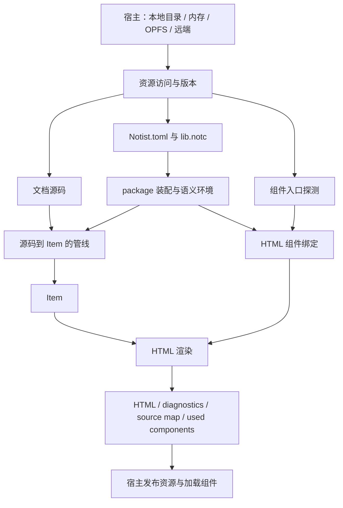

# 资源访问与增量计算

2026-10-05 · 更新：宿主资源边界与环境复用 · 状态：完整资源契约与增量能力待设计 · 范围：资源模型、package 装配、缓存、失效、编辑器预览

本轮 crate 组织与最小资源接入范围见[管线与 Vault 装配边界](2026-10-05-pipeline-vault-html.md)。本文继续记录完整资源契约、缓存失效和局部增量的后续方向，不表示这些能力均纳入本轮实施。

## 动机

- 最小资源边界已由顶层 `Resources`、`FsResources`、`MemoryResources` 和 `PreparedInputs` 提供，配置与 package 装配可复用。资源身份的版本、回收以及 OPFS 或远端适配仍需要结合宿主设计。
- 文档分析每次完整运行，LSP 还会重新装配项目。正文编辑通常没有改变 package 声明，却重复支付环境构建成本。
- 预览结果不只取决于正文：配置、声明、组件绑定也会改变结果。仅跟踪正文版本无法表达环境变化及其失效范围。
- Celestite 的防抖、结果缓存和过期任务拒绝属于调度机制；Rowan 语法树也不自动提供管线的增量复用。资源缓存、环境缓存和局部增量需要分别设计。

## 变更总览

以下均为后续目标，具体接口与实施范围尚未确定。

| 领域 | 目标变化 |
| --- | --- |
| 资源身份 | 逻辑资源保留项目或 package 归属及内部路径，宿主映射物理位置 |
| 资源访问 | 共享只读契约，适配本地目录、内存覆盖、OPFS 和远端资源 |
| package 装配 | 配置与声明通过共同资源入口取得，装配规则不依赖具体存储 |
| HTML 绑定 | 共享组件入口约定和冲突检查，浏览器 URL 由宿主解析 |
| 环境复用 | 未变化的声明模块、语义 Registry 和 HTML 绑定环境可复用 |
| 失效 | 配置、声明、组件入口和未保存覆盖参与版本判定 |
| 预览 | 任务关联环境版本，环境变化触发重算，旧环境结果不能覆盖新结果 |
| 增量 | 先复用环境，再按测量结果考虑文档缓存、局部解析和语义计算 |

## 架构

资源取得与处理管线分开：宿主提供输入，装配层建立声明环境，文档管线与 HTML 层消费同一份环境。最小 `Resources` 和 `Vault` 位于顶层 `notist`；完整版本契约是否另行抽象、跨视图环境复用如何组织，留待后续设计。

同一次任务需要确定的输入版本；缓存命中只复用这些输入对应的结果。配置和声明的装配错误保留来源，不能以旧环境的结果冒充新版本已成功处理。

## 资源与环境模型

### 资源身份与访问

资源身份表达逻辑归属，例如某 package 内的 `components/diagram/index.js`。本地文件路径、OPFS 定位方式和远端地址由资源提供者解释；浏览器 module URL 由发布或加载阶段解析。源码与二进制资源使用共同的身份体系，诊断保留产生它的来源文件。

只读资源契约至少支持内容读取与候选入口检查，并区分不存在、读取失败和尚未准备好。写入、文件监听、下载策略和编辑器持久化继续由宿主负责。接口形状及错误类型待定。

配置发现与依赖路径解析属于项目装配；`components/<函数名>.js` 和 `components/<函数名>/index.js` 的候选规则及冲突判断属于 HTML 绑定。各宿主提供访问能力，共享层维持同一套规则。读取失败不能被当作缺少组件实现。

### 输入一致性与异步边界

浏览器取得资源可能需要异步操作。目前保留两个候选方向：宿主先异步准备稳定资源快照，再执行同步管线；或让装配阶段支持异步访问。选择需结合 Celestite 的资源与 Worker 契约另行讨论。

无论使用哪个方案，一次任务都应关联确定的配置、声明和组件绑定版本。未保存源码覆盖也属于输入；撤销覆盖后，需要重新判定底层资源版本，不能继续命中过期覆盖的缓存。

### 环境缓存与失效

第一步考虑缓存声明模块、装配后的语义 Registry 和 HTML 绑定环境，正文变化时仍完整处理当前文档。缓存键包含输入版本或内容指纹，路径只能确定身份，不能单独证明内容未变。

| 输入变化 | 目标失效范围 |
| --- | --- |
| 正文 | 当前文档的分析与渲染结果 |
| `Notist.toml` | 依赖装配与使用该环境的文档任务 |
| `lib.notc` | 对应声明及使用其环境的文档分析与渲染 |
| 组件入口存在性或绑定 | HTML 环境与相关渲染结果 |
| 组件 JS 或附属资源内容 | 资源发布与浏览器加载，是否重渲染待定 |

入口探测的不存在结果也属于依赖：新增组件、删除组件或出现双入口冲突都必须使旧绑定失效。环境 revision 可以先采用较粗粒度，是否拆分语义与 HTML 资源版本需根据实际需求确定。

Celestite 的预览任务需要关联所用环境版本。正文未变而环境变化时仍需重新调度；组件使用记录随渲染结果传递，旧环境任务的完成结果不能覆盖新环境结果。

### 文档增量计算

资源读取缓存减少 IO，计算缓存复用声明、分析或渲染结果，两者有不同的失效条件。建立稳定资源快照并不意味着局部增量已经实现。

环境复用之后，先测量真实编辑场景的装配、文档处理和渲染开销，再决定文档级缓存与细粒度复用的收益。局部增量需要另外设计 parser 编辑接口、reflow 与 sectionize 的影响范围、源码位置偏移、诊断归属和渲染映射。是否使用 comemo、其他计算框架或自建缓存暂不确定。

## 关键设计决策

以下为草案方向，尚未形成已实施的接口契约。

1. **逻辑身份与物理位置分开**：共享层使用资源身份，宿主解释存储位置与发布 URL。
2. **规则共享，访问由宿主提供**：配置装配与组件入口规则不按存储来源各写一套。
3. **输入版本明确**：一次任务关联确定的资源和环境版本，未保存覆盖参与判定。
4. **声明与呈现分开失效**：JS 实现变化不必天然触发声明分析，具体版本粒度待定。
5. **先复用环境**：优先消除重复声明分析与装配，局部文档计算依据测量结果推进。
6. **结果与映射一起复用**：诊断、source map 和组件记录必须对应同一次正文与环境输入。

## 任务拆解

1. [ ] **资源契约**：确定逻辑身份、访问错误、来源诊断及同步／异步边界，并明确共享接口的归属。
2. [ ] **宿主适配**：接入本地资源与内存覆盖，统一配置和组件发现规则，再验证 Celestite 的资源提供方式。
3. [ ] **环境复用**：确定版本或指纹、缓存持有者、回收策略和未保存覆盖的失效机制。
4. [ ] **预览失效**：任务关联环境版本，环境变化重新调度，完整传递渲染映射与组件依赖。
5. [ ] **测量与细化**：比较缓存与无缓存执行的耗时和内存，决定是否推进文档级缓存及局部增量。

任务均未实施。资源身份与输入一致性先于缓存设计；局部增量的方案和范围等待测量后确定。

## 验收

- 本地资源与内存资源提供相同输入时，声明、文档 IR、诊断及组件绑定一致。
- 资源缺失、读取失败、入口冲突和源码覆盖保留准确来源与错误类型。
- 撤销覆盖或切换环境后不复用错误缓存；仅正文变化时不重复处理未变化的 package 声明。
- 配置和声明变化触发相关文档重算，旧环境预览结果被拒绝。
- 组件新增、删除和双入口冲突均使绑定缓存失效。
- 缓存结果与无缓存执行一致，诊断范围、source map 和组件记录对应本次输入。
- 使用真实编辑序列记录耗时与内存，区分调度优化、环境复用和局部增量的效果。

## 记录在案的边角

- pipeline 与 Vault 的职责见独立重构草案；具体资源接口和版本机制的归属仍需设计。
- 一个文档目录范围可能包含多份最近配置；环境归属与范围外依赖需要明确。
- 异步准备期间输入变化时，如何取消、重试或建立一致快照尚未确定。
- 环境装配失败时是否保留旧预览，以及新版本错误如何显示，需由接入契约表达。
- 缓存持有者、内存预算、回收策略及失效通知方式待定。
- 多 Vault 中同名组件绑定不同实现时，浏览器注册隔离、模块版本和资源生命周期需要单独设计。
- 局部计算必须考虑结构变化与绝对源码范围；不能把树节点复用直接等同于有效的 source map 复用。

本文只记录资源访问与增量计算的后续设计方向，具体接口和实施计划在进一步讨论后补充。
